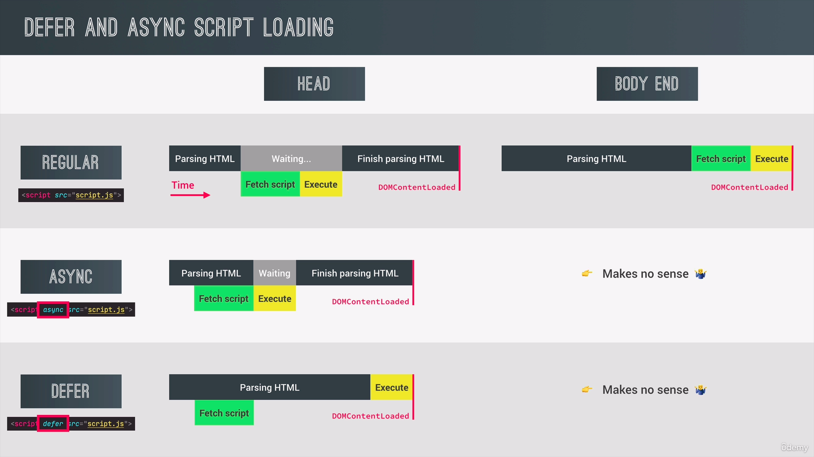

# Course notes

## A Closer Look at Functions

* First-class functions: functions in javascript can do what everybody else can do, e.g. assigned to a value, passed as an argument, returned from a function
* Functions in javascript inherit from the _Object_ prototype, so they can be assigned key-value pairs or have methods attached to them, such as `bind()`
* Higher-order functions: A function that receives another function as an argument or returns a function, e.g. `element.addEventListener()`
* In regular function calls, the `this` keyword points to `undefined`
* The `this` keyword can be assigned to a function with the function's methods `call()` or `apply()`.
  In an event handler, the `this` keyword points to the element it is attached to
* The `bind()` method attaches another object to the `this` keyword of a function.
  It can also pass default arguments for a function, which is called [partial application][2].

### IIFE

```javascript
(function () {
  console.log('This is called only once')
})();
```

* used to call code only once or define scoped variables
* variables defined with `let` or `const` are also scoped inside a block, while variables declared with `var` are not scoped

```javascript
{
  const a = 'this is scoped'
  let b = 'this is also scoped'
  var c = 'this is not scoped'
}
```

## Numbers, Dates, Intl and Timers

### Working with BigInt

* regular numbers are represented with 64 bits.
  The highest possible number that can be represented correctly in JS is `2**53 -1`, because the other bits are used for storing the sign and the decimal places, plus counting starts at 0.
* BigInt can be written as `123n` or `BigInt(123)`, though latter is susceptible for errors when converting from a regular number.
* Operations between BigInt and regular numbers are restricted.
* `Math` operations are not possible.


### I18N
* `Intl.DateTimeFormat(locale, options)` can be used to display dates based on the user's preference.
* `Intl.NumberFormat(locale, options)` can be used to display numbers, units and currencies.
* The locale can be determined by `navigator.locale` for example.

## Advanced DOM and Events

* > The Document Object Model (DOM) is the data representation of the objects that comprise the structure and content of a document on the web.
  > &mdash; <cite>[MDN Web docs][1]</cite> 
* Every object in a document inherits from a `Node`.
* `Node` as well as all inheriting classes add their own methods, like e.g. `.querySelector()`
* The four main objects that inherit from `Node` are the _Element_, _Text_, _Comment_, and `document.documentElement`
* `Node` also inherits from `EventTarget`.
  This provides methods like `.addEventListener()`
* The `window` object also inherits from `EventTarget`


### Selecting, creating and deleting Elements

* `querySelector` returns a `NodeList` that is not updated when elements are deleted.
  `getElementsByTagName()` returns a `HTMLCollection` that is updated when elements are deleted
* Methods to insert inside an element: `element.prepend()`, `element.append()`
* Methods to insert as a sibling to an element: `element.before()`, `element.after()`
* `Element.insertAdjacentHTML()` can do the same with a different syntax.
* Elements created with `document.createElement()` are unique, and have to be copied with `element.cloneNode()` to be duplicated.
  `cloneNode` takes a boolean as an argument to specify if the child elements should be copied as well.

### Events
* In the capturing phase, the event is captured in the _Document_ and travels along the DOM tree to the target element
* In the bubbling phase, events travel up the DOM tree to its parent elements and can trigger events there
* Not all events have a capturing and a bubbling phase but are only triggered on the target element
* Events can also be handled in the capturing phase by setting the option `{capture: true}` to `element.addEventListener()`
* **Event delegation** increases performance and saves memory
* > The DOMContentLoaded event fires when the initial HTML document has been completely loaded and parsed, without waiting for stylesheets, images, and subframes to finish loading.
  > &mdash; <cite>[MDN Web docs][3]</cite> 
* > The load event is fired when the whole page has loaded, including all dependent resources such as stylesheets and images.
  > &mdash; <cite>[MDN Web docs][3]</cite>
* Beware of the `beforunload` event

### Script loading

| ` async `                                                                  | ` defer `                                                             |
|----------------------------------------------------------------------------|-----------------------------------------------------------------------|
| script file is downloaded asynchronously                                   | script file is downloaded asynchronously                              |
| the execution of the script file pauses the HTML parsing                   | the script file is executed at the end of the HTML parsing            |
| the DOMContentLoaded event is not dependent on the execution of the script | the DOMContentLoaded event is fired when the script is done executing |
| scripts are executed as soon as they are finished loading                  | scripts are executed in order                                         |



## Object Oriented Programming in JavaScript

* Objects/Instances are linked to Prototype classes
* Objects delegate behaviour to their prototype class
* The `new` operator, when used on a constructor function performs following 4 steps:
  1. Create a new empty object `{}`
  2. Set the `this` keyword of the function to the new object
  3. Link the prototype to the new object (sets the `__proto__` attribute of the object to the `prototype` attribute of the constructor function)
  4. return the new object
* `{...}` is a short form for `new Object()`

### Constructor functions

#### Inheritance with constructor functions
```javascript
function Person(fullName, birthYear) {
  this.fullName = fullName
  this.birthYear = birthYear
}

function Student(fullName, birthYear, course) {
  Person.call(this, fullName, birthYear)
  this.course = course
}

Student.prototype = Object.create(Person.prototype)
Student.prototype.constructor = Student
```

### ES6 Classes

```javascript
class Person {
  constructor(fullName, birthYear) {
    this._fullName = fullName
    this.birthYear = birthYear
  }
  // method attatched to the prototype
  calcAge() {
    const now = new Date()
    return now.getFullYear() - this.birthYear
  }
  // getters and setters
  get fullName() {
    return this._fullName
  }
  set fullName(name) {
    // do validation?
    this._fullName = name
  }
  // static methods: only available on the Person class, not on the prototype
  static hey() {
    console.log("Hello there")  
  }
}
```

* classes are **not hoisted**
* classes are **first class citizens**
* classes are executed in **strict mode**

#### Inheritance with ES6 classes

```javascript
class Student extends Person {
  constructor(fullName, birthYear, course) {
    // super() needs to happen first to initialize the this keyword
    super(fullName, birthYear)
    this.course = course
  }
}
```

### Object.create()
```javascript
const PersonPrototype = {
  init(fullName, birthYear) {
    this.fullName = fullName
    this.birthYear = birthYear
  }
}
const StudentPrototype = Object.create(PersonPrototype)
StudentPrototype.init = function (fullName, birthYear, course) {
  PersonPrototype.init.call(this, fullName, birthYear)
  this.course = course
}
```

## Asynchronous Javascript

### The way it used to be

```javascript
const request = new XMLHttpRequest()
request.open('GET', 'https://api.chess.com/pub/puzzle')
request.send()
request.addEventListener('load', function () {
  console.log(this.responseText)
})
```

### The modern way: fetch api

A promise is a container for a value that will be populated in the future.

```javascript
const request = fetch('https://api.chess.com/pub/puzzle')
        .then(response => response.json())
        .catch(err => console.error(err.message))
        .finally(() => console.log("done"))
```

### The event loop

* Functions inside the call stack are executed primarily
* When the call stack is empty, then all tasks in the "microtasks queue", that come from promises, are executed
* Only when the microtasks queue is empty, the callback queue is executed

### Building a promise

```javascript
new Promise(function (resolve, reject) { 
  if (Math.random() >= 0.5) resolve("success")
  if (Math.random() < 0.5) reject("error")
})
```

### async/await

* Instead of using `.then()` to process the value returned by a Promise, we can use `await`.
* basically only syntactic sugar
* `await` can only be used inside functions defined with `async`.
  To still execute them, one can use an IIFE.
  ```javascript
  (async function() {
    const response = await fetch("...")
    const data = await response.json()
    console.log(data)
  })()
  ```
* asynchronous functions can be run in parallel with the methods `Promise.all()`, `Promise.allSettled()`, `Promise.race()` or `Promise.any()`


[1]: https://developer.mozilla.org/en-US/docs/Web/API/Document_Object_Model/Introduction
[2]: https://en.wikipedia.org/wiki/Partial_application
[3]: https://developer.mozilla.org/en-US/docs/Web/API/Window/DOMContentLoaded_event
[4]: https://developer.mozilla.org/en-US/docs/Web/API/Window/load_event
